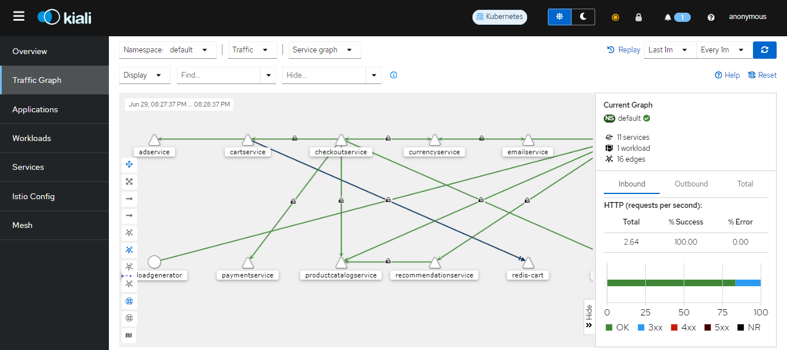

# Setting Up Istio Service Mesh in a Kubernetes Cluster Using `istioctl`

This guide provides step-by-step instructions to set up Istio, an open-source service mesh, on a Kubernetes cluster using the `istioctl` command-line tool.

## Prerequisites

Before you begin, ensure you have the following:

1. A running Kubernetes cluster (v1.18 or newer).
2. `kubectl` configured to communicate with your cluster.
3. `istioctl` installed. You can download the latest version from the [Istio releases page](https://github.com/istio/istio/releases). or just follow steps below to download. 

## Step 1: Download and Install Istioctl

1. **Download Istio:**
    ```sh
    curl -L https://istio.io/downloadIstio | sh -
    ```
    The command above downloads the latest release (numerically) of Istio. You can pass variables on the command line to download a specific version or to override the processor     architecture. For example, to download Istio 1.22.1 for the x86_64 architecture, run:
    ```sh
    curl -L https://istio.io/downloadIstio | ISTIO_VERSION=1.22.1 TARGET_ARCH=x86_64 sh
    ```
2. **Navigate to the Istio package directory:**
    ```sh
    cd istio-<version>
    ```

3. **Add `istioctl` to your PATH:**
    ```sh
    export PATH=$PWD/bin:$PATH
    ```

## Step 2: Install Istio on Kubernetes

1. **Install Istio with the default profile:**
    ```sh
    istioctl install --set profile=default -y
    ```

2. **Verify the installation:**
    ```sh
    kubectl get pods -n istio-system
    ```

   Ensure all pods are in a `Running` or `Completed` state.
   ```
   NAME                                    READY   STATUS    RESTARTS   AGE
   istio-ingressgateway-66c5cb4897-knwcx   1/1     Running   0          24h
   istiod-6cd77db567-d99zq                 1/1     Running   0          24h
   ```

## Step 3: Label the Namespace for Istio Sidecar proxy Injection
  A sidecar proxy is a design pattern in microservices architecture where an additional proxy service is deployed alongside the main application service in the same deployment     unit, such as a Kubernetes pod. This proxy service handles various concerns that the main application service would otherwise need to manage itself, such as networking,       
  security, and observability.

1. **Label your namespace (replace `default` with your namespace):**
    ```sh
    kubectl label namespace default istio-injection=enabled
    ```
   The `istio-injection=enabled` key value pair is something that istio would understand and will inject the sidecar proxy in whichever namespace having this label, in this case     it is in the `default` namespace

2. **Verify the label:**
    ```sh
    kubectl get namespace -L istio-injection
    ```
    
## Step 4: Deploy a Sample Microservices Application

1. **You  can check here for a [demo app](https://github.com/GoogleCloudPlatform/microservices-demo) that we can deploy to our k8s cluster,go to release and just download the `kubernetes-manifests.yaml` file, this contains the configurations for the microservice app. Run the command below to apply this configurations:**
  ```sh
  kubectl apply -f kubernetes-manifests.yaml
  ```
2. **Verify the application pods:**
   ```sh
   kubectl get pods
   ```
## Step 5: Install istio addons for monitoring and data vizualization
So now we have the Istio component running in a cluster that automatically injects the Envoy proxy container into every pod that we create in a default namespace. We have all that configuration already set up, which is great, but we don't have any data visualization for what's going on in our microservices. Istio collects metrics from all these proxy containers, so you have data about how your microservices are performing, what kind of requests they're getting, metrics data, and so on.
1. In the istio folder , go to **samples > addons**, apply all of thiese manifests :
   ```sh
   kubectl apply -f samples/addons
   ```
2. Kiali is an observability tool for managing and visualizing service meshes, particularly those using Istio. It provides a graphical interface to help understand the structure and health of your microservices architecture. you can port forward to the kiali web ui and access using localhost.
   ```sh
   kubectl port-forward <pod-name> <local-port>:<pod-port> -n <namespace>
   ```
   For example, you should have a pod named kiali-64c4548985-tbm4b  in the istio-system namespace, and you want to forward port 8080 on your local machine to the port on the 
  kiali pod:
   ```
   kubectl port-forward kiali-64c4548985-tbm4b  8080:20001 -n istio-system
   ```
   
   

   

## Conclusion

You have successfully set up Istio on your Kubernetes cluster using `istioctl`. This setup provides a robust service mesh that enhances your application's observability, security, and traffic management capabilities.

With Istio installed, you can now:

- **Monitor and visualize traffic** within your service mesh using Istio's telemetry features.
- **Secure communications** between services with mutual TLS authentication.


   
  
    
